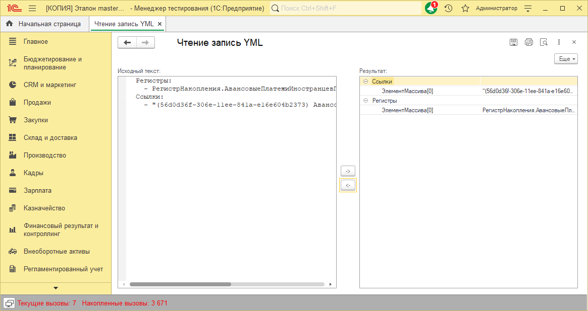

# Чтение yml 1с

Примитивный парсер yml файлов на языке 1С

Умеет читать YML в соответствие (или структуру если пропишете)

Умеет записывать соответствие/структуру/массив в строку YML

__[Скачать](https://github.com/kuzyara/1c-yaml-parser/releases/latest/download/YAML.epf)__

Статья на инфостарте https://infostart.ru/1c/tools/2053702/
